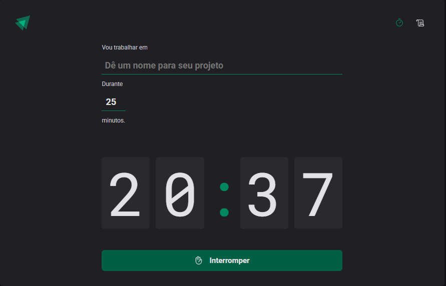

# Ignite Timer

<p align="center">
   
</p>

Este projeto é um timer de ciclos de trabalho desenvolvido com React, TypeScript, Vite e Styled Components. Ele permite criar ciclos de tarefas, acompanhar o tempo restante e visualizar o histórico de ciclos.

## Funcionalidades
- Iniciar e interromper ciclos de trabalho
- Definir nome da tarefa e tempo do ciclo
- Contagem regressiva do tempo
- Histórico de ciclos realizados, interrompidos e concluídos
- Interface responsiva e moderna

## Tecnologias Utilizadas
- [React](https://react.dev/)
- [TypeScript](https://www.typescriptlang.org/)
- [Vite](https://vitejs.dev/)
- [Styled Components](https://styled-components.com/)
- [Phosphor Icons](https://phosphoricons.com/)
- [React Hook Form](https://react-hook-form.com/)
- [Zod](https://zod.dev/)
- [date-fns](https://date-fns.org/)

## Como rodar o projeto

1. **Instale as dependências:**
   ```sh
   npm install
   ```
2. **Inicie o servidor de desenvolvimento:**
   ```sh
   npm run dev
   ```
3. **Acesse no navegador:**
   Abra [http://localhost:5173](http://localhost:5173) para visualizar o app.

## Estrutura de Pastas
```
src/
  components/        # Componentes reutilizáveis
  layouts/           # Layouts de página
  pages/             # Páginas principais (Home, Countdown, History, NewCycleForm)
  styles/            # Estilos globais e temas
  assets/            # Imagens e ícones
```

## Personalização
Você pode alterar o tema em `src/styles/themes/default.ts` e modificar estilos globais em `src/styles/global.ts`.

## Licença
Este projeto é apenas para fins de estudo e não possui licença comercial.
